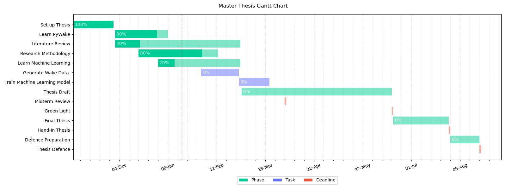

# Gantt Chart in Python
This Python script generates a Gantt Chart based on input data provided in a CSV file.




## Run the script:

```bash
python gantt_chart.py --file_path path/to/your/data.csv
```

## Sample CSV Format

Ensure your CSV file follows the format below:

```csv
Task,Category,Start,End,Completion
Task1,Phase,01-11-2023,30-11-2023,1
Task2,Task,01-12-2023,29-02-2024,0.2
Task3,Deadline,01-12-2023,08-01-2024,0.8
```
